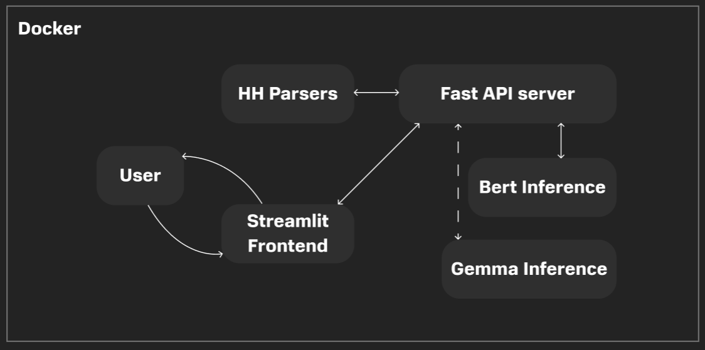

# ФИЦ Хакатон (1 место)
 
*MISIS Neychev Loss*

Team Members:

1. **Александр Груздев** - ML, Pitch
2. **Максим Литвинов** - ML
3. **Рыжичкин Кирилл** - ML, Backend, Frontend
4. **Татьяна Янчук** - Design

Презентация: [тык](https://drive.google.com/file/d/1rR_HkbhxQSNZW0stf5gLDu7tbQ2CH9E6/view?usp=sharing)

Демонстрация веб-сервиса: [тык](https://drive.google.com/file/d/1rjdbdda2kV9LLqoA42z9-2Js45z8ZWsJ/view?usp=sharing)

Демонстрация Swagger: [тык](https://drive.google.com/file/d/1h-P6fdp3FqMVqO2MTqAhDgI-ATlII9fB/view?usp=sharing)

## Кейс "Оценка уровня экспертности по резюме"

> Необходимо разработать систему оценки уровня эксперта по резюме. Для подсчёта финальной оценки можно учитывать любые факторы, информация о которых дана в резюме. Для реализации можно использовать как готовые модели с подключением по API, так и дообучать open-source модели или создавать свои.

## Оглавление

1. [Блок-схема решения](#блок-схема-решения)
2. [Очистка данных](#очистка-данных)
3. [Обучение моделей](#обучение-моделей)
4. [Интересные замечания](#интересные-замечания)
5. [Парсинг данных о компаниях](#парсинг-данных-о-компаниях)
6. [Фронтенд](#фронтенд)
7. [Эндпоинты](#эндпоинты)
8. [Инструкция по запуску](#инструкция-по-запуску)
9. [Наши преимущества](#наши-преимущества)
10. [Структура репозитория](#структура-репозитория)

## Блок-схема решения:



## Очистка данных:

В последнем столбце `work_experience` было обнаружено большое количество дублирующихся блоков текста в каждой строке, в итоге везде был оставлен только первый блок. Более никакого препроцессинга не производилось и все силы были приложены к обучению различных моделей.

## Обучение моделей:

1. **cointegrated/rubert-tiny2**
 - дал крайне низкий roc-auc 0.51
 - 5 эпох обучения заняло 6 минут (2xT4)
 - нестабильный
 - max_length ограничена 512 токанами
2. **Tochka-AI/ruRoPEBert-e5-base-2k**
 - дал по-прежнему невысокий roc-auc 0.53
 - 5 эпох обучения заняло 10 часов (2xT4)
 - нестабильный
 - max_length 2048 токенов
 3. **unsloth/gemma-2-9b-it-bnb-4bit**
 - прирост до `0.61 roc-auc`
 - 1 эпоха обучения заняла 8 часов (4xL4)
 - max_length 1024 токенов
 - LoRA Adapter для `q, k, v, o, up, down, proj`

Ввиду сильного дисбаланса классов все модели учились с `Focal Loss (gamma = 2)`, распределение классов в валидационной выборке `было сохранено таким же`, каким оно было изначально для получения честных метрик.

Скачать веса: [gemma](https://huggingface.co/TheStrangerOne/FIC-SENCE-Gemma-LORA), [rubert](https://huggingface.co/lightsource/fic-rubert-tiny-2-chckpnt800), [ruropebert](https://huggingface.co/lightsource/fic-ruropebert-tochka-ai)

Для инференса воспользуйтесь [данным скриптом](ml/generate_final_submission.py) - необходимо будет указать путь к папке со скачанными локально [весами адаптера](https://huggingface.co/TheStrangerOne/FIC-SENCE-Gemma-LORA), а также к новому тестовому датасету.

## Интересные замечания:

1. **Custom Head**
   ```python
   self.score = torch.nn.Sequential(
       torch.nn.Dropout(0.1),
       torch.nn.Linear(config.hidden_size, config.hidden_size // 2),
       torch.nn.Dropout(0.1),
       torch.nn.GELU(),
       torch.nn.Linear(config.hidden_size // 2, config.num_labels),
   )
   ```
   Это значительно улучшило обучение на ранних шагах и последующую сходимость.

2. **Разные LR для головы и бэкбона**
   - В случае Gemma:
      ```python
      backbone_LR = alpha / rank * head_LR
      ```
   - В случае BERT:
       ```python
       head_LR = backbone_LR * 10
       ```
   Это также обеспечило более стабильное обучение, было подсмотренно у [Chris Deotte](https://www.kaggle.com/competitions/lmsys-chatbot-arena/discussion/527596).

 3. **Truncation слева**
    ```python
    def prepare_text(self, age, city, work_experience, position, key_skills, client_name, salary):
    rounds = [
        f'<start_of_turn>age\n{age}\n\ncity\n{city}\n\n'
        + f'work_experience\n{work_experience[:-700]}\n\n'
        + f'position\n{position[:100]}\n\n'
        + f'key_skills\n{key_skills[:200]}\n\n'
        + f'client_name\n{client_name}\n\n'
        + f'salary\n{salary[:200]}<end_of_turn>'
    ]
    
    tmp = '\n'.join(rounds)
    for k in range(len(rounds)):
        tmp = '\n'.join(rounds[k:])
        if len(self.tokenizer(tmp)['input_ids'] ) < self.max_length: 
            break
    
    return tmp
    ```
    Данный прием точно также был подсмотрен у [Chris Deotte](https://www.kaggle.com/competitions/lmsys-chatbot-arena/discussion/527596) в соревновании LMSYS.

## Парсинг данных о компаниях:

С помощью `Selenium` парсим данные с [hh.ru](https://rating.hh.ru/history/rating2023/summary?tab=giant) за 2023 год.

Извлекаем:
- название компании
- место в рейтинге
- тип компании
- регион, в котором компания базируется
- к какой отрасли относится компания
- итоговый балл в своей категории

## Фронтенд:

- выполнен на streamlit
- адаптивен для любых устройств
- поддерживает загрузку PDF, ссылок на HH-резюме
- поддерживает ручной ввод
- поддерживает загрузку JSON в train формате
- выводит рейтинг компании в которую подается кандидат, а также доп. статистику
- отчет с предсказаниями можно скачать

Обратите внинмание, что ввиду отсутствия ресурсов для инференса тяжелых моделей для демонстрации используется наша самая легковеская модель: [rubert-tiny-2](https://huggingface.co/lightsource/fic-rubert-tiny-2-chckpnt800)

## Эндпоинты:

### POST /upload-pdf/
Загружает PDF-файл HH резюме и извлекает информацию из него.

**Параметры:**
- `file` (UploadFile): Загружаемый PDF-файл.
- `session_id` (str): Уникальный идентификатор сессии.

**Ответ:**
- `status` (str): Статус обработки (`success` или `error`).
- `data` (dict): Извлеченные данные.

---

### POST /process-hh-link/
Обрабатывает ссылку на резюме с hh.ru и извлекает данные.

**Параметры:**
- `link` (str): Ссылка на резюме.
- `session_id` (str): Уникальный идентификатор сессии.

**Ответ:**
- `status` (str): Статус обработки (`success` или `error`).
- `data` (dict): Извлеченные данные.

---

### POST /upload-json/
Загружает JSON-файл в train формате и сохраняет данные для текущей сессии.

**Параметры:**
- `file` (UploadFile): Загружаемый JSON-файл.
- `session_id` (str): Уникальный идентификатор сессии.

**Ответ:**
- `status` (str): Статус обработки (`success` или `error`).
- `data` (dict): Загруженные данные.

---

### POST /manual-input/
Ручной ввод данных пользователя.

**Параметры:**
- `position` (str): Позиция.
- `age` (int): Возраст.
- `city` (str): Город.
- `key_skills` (str): Ключевые навыки.
- `work_experience` (str): Опыт работы.
- `session_id` (str): Уникальный идентификатор сессии.

**Ответ:**
- `status` (str): Статус обработки (`success` или `error`).
- `data` (dict): Сохраненные данные.

---

### POST /process-data-bert/
Обрабатывает данные пользователя с помощью модели BERT.

**Параметры:**
- `client_name` (str): Название компании.
- `expected_grade_salary` (str): Ожидания по грейду и зарплате.
- `session_id` (str): Уникальный идентификатор сессии.

**Ответ:**
- `status` (str): Статус обработки (`success` или `error`).
- `prediction` (float): Предсказание модели.
- `data` (dict): Результаты обработки.

---

### POST /process-data-bert-json/
Обрабатывает JSON-данные с помощью модели BERT.

**Параметры:**
- `session_id` (str): Уникальный идентификатор сессии.

**Ответ:**
- `status` (str): Статус обработки (`success` или `error`).
- `prediction` (float): Предсказание модели.
- `data` (dict): Результаты обработки.

---

### GET /download-results/
Скачивает результаты анализа в формате JSON.

**Параметры:**
- `session_id` (str): Уникальный идентификатор сессии.

**Ответ:**
- JSON-файл с результатами анализа, включая предсказание и детали резюме.

---

## Инструкция по запуску:

```bash
docker build -t fic-sense-case .
docker run -d -p 8000:8000 -p 8501:8501 fic-sense-case
```

## Наши преимущества:
- проведены эксперименты, обучены различные модели в различных конфигурациях
- предоставляем готовое встраиваемое решение: API интегрируемо, а Streamlit сервис позволяет удобно взаимодействовать с ним
- помимо обычного json, работаем с HH-резюме в .pdf и url форматах
- работа с внешними данными о компаниях
- полная документация

## Структура репозитория

```
.
├── .streamlit/                        # Конфигурационные файлы Streamlit
│   └── config.toml                    # Настройки сервера и стилей
│
├── ml/                                # ML скрипты
│  ├── bert_inference.py               # Инференс для BERT модели
│  ├── bert_train.py                   # Обучение BERT
│  ├── gemma_inference.py              # Инференс для Gemma
│  ├── gemma_train.py                  # Обучение модели Gemma
│  ├── gemma_train_unstratified.py     # Обучение Gemma без стратификации
│  └── generate_final_submission.py    # Скрипт для генерации итогового сабмита для рассчета метрик
│
├── notebooks/                         # Jupyter ноутбуки
│  ├── gemma-lora-train.ipynb          # Ноутбук для обучения Gemma
│  ├── hh_ratings_parse.ipynb          # Ноутбук для парсинга рейтингов HH
│  ├── ruropebert_train.ipynb          # Ноутбук для обучения модели RuRoPEBERT
│  └── unstratified_gemma_train.ipynb  # Ноутбук для обучения Gemma без стратификации
│   
├── parsers/                           # Скрипты для парсинга данных
│  ├── chromedriver-win64/             # Chrome драйвер для Selenium
│  ├── data/                           # Спаршенные данные
│  │   └── rating_summary_2023.csv     # Рейтинг компаний с HH
│  ├── find_company_info.py            # Извлечение информации о компании
│  ├── hh_document_parser.py           # Парсинг HH резюме в .pdf формате
│  ├── hh_link_parser.py               # Парсинг HH резюме в url формате
│  └── hh_ratings_parser.py            # Парсинг рейтингов HH
│
├── service/                           # Сервис
│  ├── backend.py                      # Логика бэкенда
│  └── frontend.py                     # Логика фронтенда
│
├── Dockerfile                         # Dockerfile для создания контейнера
├── README.md                          # Документация
└── requirements.txt                   # Зависимости библиотек
```
